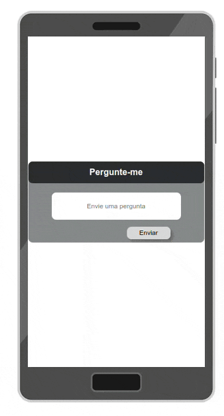

## Rodando localmente

Clone o projeto

```bash
  git clone git@github.com:luizlacerdam/agora-technical-test.git
```

Entre no diretório do projeto

```bash
  cd agora-tecnical-test/front-end
```

Instale as dependências

```bash
  npm install
```

Inicie o servidor

```bash
  npm run dev
```


## Demonstração



